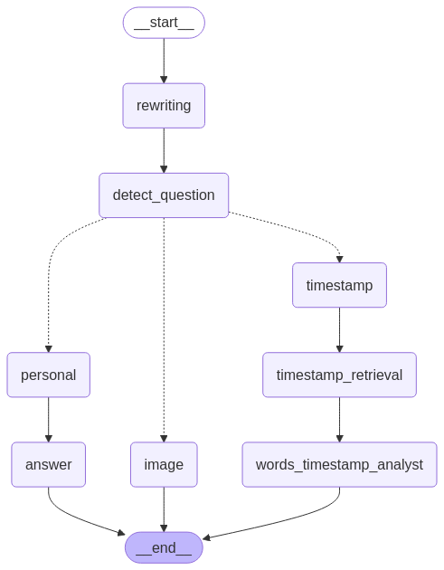

# MainGames


## Installation
Tested on Ubuntu 22.04, python==3.11
1. Clone the repository:
   ```bash
   git clone https://github.com/JianNguyen/maingames.git
   ```
2. Install the required dependencies:
   ```bash
   conda create -n excer1 python==3.11 -y
   conda activate excer1
   cd {root_path}
   pip install -r requirements.txt
   ```
3. Run vector database (pgvector):
   ```bash
   cd ./services/pgvector
   docker compose -up -d
   ```
4. Add .env file in root path: Following instructure in `.env_example`
5. Run the application:
   ```bash
   python main.py
   ```
---

## Usage
1. Launch the application by running `python main.py`.
2. Access the Gradio interface through your web browser (default: `http://localhost:7860`).

---

## Mutiple Agents


---

## Table relationship
```bash
+-----------------+        +-----------------+        +------------------+        +-------------------+        +------------------+
|   sources      |        |  embeddings     |        |  graph_edges     |        |  wordstimestamp   |        |  imagesstorage   |
+-----------------+        +-----------------+        +------------------+        +-------------------+        +------------------+
| id (PK)        |◄──┐    | id (PK)         |        | source_id (PK,FK)|        | id (PK)          |        | id (PK)          |
| source_url     |   │    | video_id (FK)   |◄──┐    | target_id (PK,FK)|◄──┐    | video_id (FK)    |◄──┐    | video_id (FK)    |◄──┐
| text           |   │    | text_chunk      |   │    | similarity       |   │    | word             |   │    | image_data       |   │
| duration       |   │    | embedding       |   │    | created_at       |   │    | start_time       |   │    | created_at       |   │
| created_at     |   │    | created_at      |   │    |                  |   │    | end_time         |   │    |                  |   │
+-----------------+  │    +-----------------+   │    +------------------+   │    | created_at       |   │    +------------------+   │
                     │                          │                           │    +-------------------+  │                           │
                     │                          │                           │                           │                           │
                     └────────────────────────► └────────────────────────── ┘────────────────────────────────────────────────────────


```
---
## Tech Stack
- CLIP
- LLM (gemini)
- Lang graph, RAG
- Gradio
- Vector searching
## License
This project is licensed under the MIT License. See the `LICENSE` file for details.

---
